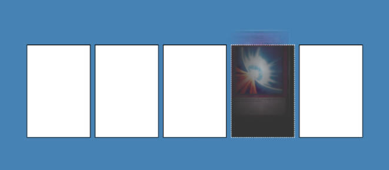

# Drag and Drop in JavaScript

Create a simple drop and drop in JavaScript

Learned about the draggable attribute in HTML

# Styling

Also added styling for hovering and holding and Item
Used JavaScript event Listener for drag and drop.

Event listeners I used
- drag start
- drag end
- drag over
- drag leave
- drag and drop

